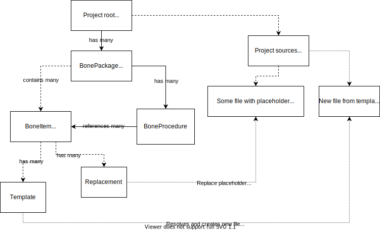

# Murray

Murray is a set of tools for Skeleton-based software development.

**Skeleton-based** software usually consists of code generated through lots of boilerplate that can't be abstracted and re-used through software architecture principles.

For instance, a classic HTML website always consists of pages with same `head` and `body`, filled with custom data in repeating structures.

Murray defines a common and simple design language made of specifications (JSON specs) and template files, wraps them in structured packages ("Bones") and provides tools for developers to quickly use them in their projects.
Speeding up development process, avoiding annoying and shared coding mistakes and enforcing proper folder structures are some of Murray's main goals.

# In a nutshell

Projects are usually made of groups of boilerplate files that has a fixed structure and part of their contents changing according to some input.

Some examples can be iOS' `UIViewController`, Android's `Activity`, controllers for Web MVC, actions/reducers for React, etc.

These files are always created from scratch in specific subfolders, replaced with some placeholder (in both filename and contents) and then completed with proper context-related implementations.

Murray addresses the first problem (folder structure) with JSON specs and the second one (placeholders) with Stencil templates. 

Stencil templates are text files where everything wrapped around double curly braces (like `{{ this }}`) can be replaced by a key-value pair, where the key is the wrapped word and the value is the actual substitution.
An example template for a `UIViewController` can be

```swift
import UIKit
class {{ name|firstUppercase }}sViewController: UIViewController {

  let {{ name|firstLowercase }}s: [{{ name|firstUppercase }}] = []

  func viewDidLoad() {
    super.viewDidLoad()
  }
}
```

Example execution command (from CLI): `murray bone new viewController product`

When executed by Murray with some parameters, this template will actually render it's context by replacing `name` occurrences with whatever provided, and applying *filters* like uppercase, lowercase, etc.

Rendered result will then be copied to a destination folder according to template's specifications in `BoneItem.json` file with these contents: 

```swift
import UIKit
class ProductsViewController: UIViewController {

  let products: [Product] = []

  func viewDidLoad() {
    super.viewDidLoad()
  }
}
```

Different templates can be rendered sequentially by a single execution, leading to a standardized way of software developmen

# Key Features

- Clone a **skeleton** project from a remote repository, customize it with your project name and custom properties and have it ready to run. Murray supports **tags** and **branches** for remote repositories (`@develop` or `@1.0.0`)

- Develop your project with **bones**: template files you design that gets easily integrated in your project structure. If a adding a screen to your app requires 3 new files, you can design them with a template and have Murray resolve them for you and move the result in proper folders.

- Install bones templates from any number of different repositories: share your file templates with your team.

- Automatically add slices of code to already existing files when adding new bones (*example: Add a custom xml tag for your new Activity at the end of the Android manifest.xml when creating an Activity from a custom bone*).

- Easily manage and check your bones environment: see what's available directly from CLI

- Design your **bones** with **[Stencil](https://github.com/stencilproject/Stencil)**

- Integrate Murray functionalities in any Swift application through **MurrayKit** framework

# Installation

## MacOS

#### Using *[Mint](https://github.com/yonaskolb/mint)*


```
mint install synesthesia-it/Murray
```
Note: please ensure you're using at least Mint v0.12 (Swift 5)

#### Compiling from source (latest version from *master* branch)

```
curl -fsSL https://raw.githubusercontent.com/synesthesia-it/Murray/master/install.sh | sh
```

## Linux (*experimental*, tested on Ubuntu 18)

Install Swift compiler ([guide](https://gist.github.com/Azoy/8c47629fa160878cf359bf7380aaaaf9) here)
then

```
sudo apt-get install libdispatch-dev
clone murray https://github.com/synesthesia-it/Murray/tree/develop
cd Murray
touch LinuxMain.swift
swift build -c release
copy .build/x86_64-unknow-linux/releas /opt/
alias murray='/opt/Murray/murray'
```

(credits to @beppenmk)

# Key Concepts
Murray can be represented by following diagram.



## Skeleton

A skeleton is an empty project, containing any type of file and folder.
The Skeleton is a shared starting point for a new project, and should not contain any bone template; in other words, the project should work out of the box as a real project.
To be compatible with Murray, a Skeleton project must contain a `Skeletonspec.json` file in its root folder.

## Bone

A Bone is a piece of boilerplate code splitted into one or more template files. 
A template file is usually NOT working out of the box, but needs to be *resolved* against some kind of context, and then copied into proper folder.

## BoneItem

A BoneItem represents a group of template files that can be resolved and copied into current project.
BoneItems consist in a folder containing a `BoneItem.json` file and any number of template files.

`BoneItem.json` fields are: 

- `name`: a name identifying current item.
- `paths`: an array of path objects, made by a `from` and a `to` string value. 
  `from` represents a folder or a file relative to BoneItem.json itself and containing some template that needs to be copied into target project.
  `to` represents target folder path, relative to project's root (the one containing the `Murrayfile.json` file.)
  Both `from` and `to` paths are *resolved* against provided context, meaning that every Stencil placeholder will be converted in context value, if available.
- `parameters`: an array of objects representing all the keys expected by templates. Each object must contain a `name` string parameter (the actual name used in the template) and an optional `isRequired` boolean flag.
    If a `required` parameter is not found in provided context, the execution will stop with an error.
- `replacements`: an array of `replacements` associated to current item. See `Replacement` for more informations.
- `plugins`: an object where the key represents the name of a pre-installed plugin, and its object counterpart is strictly plugin-dependent. See `Plugin` section for more informations.

Example:

  ```json
  { 
    "name": "viewController",
    "paths": [{ 
    "from": "ViewController.template.swift",
    "to": "Sources/ViewControllers/{{ name|firstUppercase}}/{{ name|firstUppercase }}ViewController.swift"
   }],
    "replacements": [],
    "parameters": [
      {
        "name": "name",
        "isRequired": true
      }
    ],
    "plugins": {
      "xcode": { "targets": ["App"] }
    }
   }
  ```

## BoneProcedure

A **Procedure** is a sequence of items resolved and installed in target project across a single execution. The procedure is identified by the `name` parameter.

## BonePackage

A **Package** is a group of items and procedures that can be shipped through git or zips and reused across different projects.
It should contain a json file representing it's structure (default name: `BonePackage.json`) and any number of folders including Items.
`BonePackage.json` fields are: 

- `name`: a name identifying the package. 
- `description`: a description string explaining the package's main purpose. Will be printed by CLI commands
- `procedures`: an array of **BoneProcedure** objects.

Example:

```json
{
  "description" : "A package for quick MVVM scaffolding.",
  "procedures" : [
    {
      "items" : [
        "viewModel\/BoneItem.json",
        "viewController\/BoneItem.json",
        "model\/BoneItem.json"
      ],
      "description" : "Creates an group of Model, ViewController and ViewModel",
      "name" : "section"
    }
  ],
  "name" : "MVVM"
}

```

## Murrayfile

The Murrayfile is located in the root folder in `Murrayfile.json` file and contains basic setup for bones (relative paths to BoneSpecs) and environment context.
`Murrayfile.json` fields are: 

- `packages`: an array of paths relative to Murrayfile folder pointing to a `BonePackage.json` file
- `environment`: an object representing a shared context for each resolution. Can contain simple data such `author` name, `packageName` and similar, or more complex array/objects that will be handled by templates.

Example: 

```json
{
  "packages" : [
    "Murray/MVC/BonePackage.json"
  ],
  "environment" : {
    "author": "Stefano Mondino",
    "company": "Synesthesia",
    "target": "App"
  }
}
```

#### SkeletonSpec

The `Skeletonspec.json` file contains informations needed by the skeleton phase of a project to be converted in an actual project.
It's deleted after proper project creation as it won't be needed anymore.

Example (for non-xcode users: `Skeleton.xcodeproj` is actually a folder.): 

```json
{
        "scripts": [
        "sh install.sh"
        ],
        "initGit": true,
        "folders" : [{
            "from": "Skeleton.xcodeproj",
            "to": "{{ name|firstUppercase }}.xcodeproj"
        }],
        "files": [
        {
            "from": "Test.swift",
            "to": "{{ name|firstUppercase }}.swift"
        }]
}
```

#### Template resolution

The conversion of a template into a proper project file, by replacing every placeholder with context values.
Templates follows [Stencil](https://github.com/stencilproject/Stencil) syntax and rules

#### Context

A key-value map/dictionary containing value that will be replaced in templates during resolution.
Context is made of **environment** values (static values) and execution values explicitly derived from CLI commands.
Example: in an Android application, an environmnent value can be the main `packageName` used by the app, while an execution value can be the `name` of the activity being created.
Environment values are set inside the `Murrayfile.json` file, in the `environment` json field. In templates, just use the same key used in the Murrayfile.

#### Replacements


# Usage

- Create a new skeleton app by cloning any remote repository with a `Skeletonspec.json` file in its root folder.

```
$ murray skeleton new CoolApp <your_remote_repo>
```

Next commands should all be used inside your freshly created project's directory.
(remind to `cd CoolApp` ;) )


Your Skeleton project must declare a `Skeletonspec.json` file in its root folder, containing a list of remote repositories containing **Bones**. 

Example:
```javascript
...
 remoteBones: ["https://github.com/synesthesia-it/Bones@develop"],
 ...
```

If you want to add Bones features to an already existing project, just create a `Skeletonspec.json` file in your root folder by using `murray skeleton scaffold` and edit it by adding one or more Bones repositories.

- Setup your project with

```
$ murray bone setup
```

This will clone all bones repositories in a local folder. You can update them by calling same command again.


- Install a Bone template into your current project

```
$ murray bone new viewSection Product
```

In this particular case, a `viewSection` bone is created in your project by copying all source file related to `viewSection` (one or more, depending on what you wrote in the `Bonespec.json`) by renaming each file replacing the bone placeholder with Product and by parsing internal text contents through Stencil.
See the [Bones](https://github.com/synesthesia-it/Murray/wiki) wiki page for more details.


- List all templates available for current project
```
$ murray bone list
```

# Documentation

See [Wiki](https://github.com/synesthesia-it/Murray/wiki) pages

# FAQ

#### I'm a Swift developer. Why shoud I use this instead of Sourcery?
---------------
[Sourcery](https://github.com/krzysztofzablocki/Sourcery) is a great software that somehow handles templates as well, but is meant to handle only Swift code and project by actually *compiling* templates in different scenarios.
Murray doesn't compile or interpret your code, it doesn't even know what programming language you're actually using. It's aimed to project's structure and boilerplate reuse across projects through git repos

#### Why Murray? Who is Murray?
---------------
  Because we're dealing with Skeleton apps and Bones and we miss Monkey Island a lot! :) We hope this tool is not as much annoying as its original counterpart!

#### Who's behind Murray?
------------


**Murray** is entirely developed and open-sourced by [Synesthesia](https://www.synesthesia.it)

We're currently using it for **iOS** and **Android** projects.
